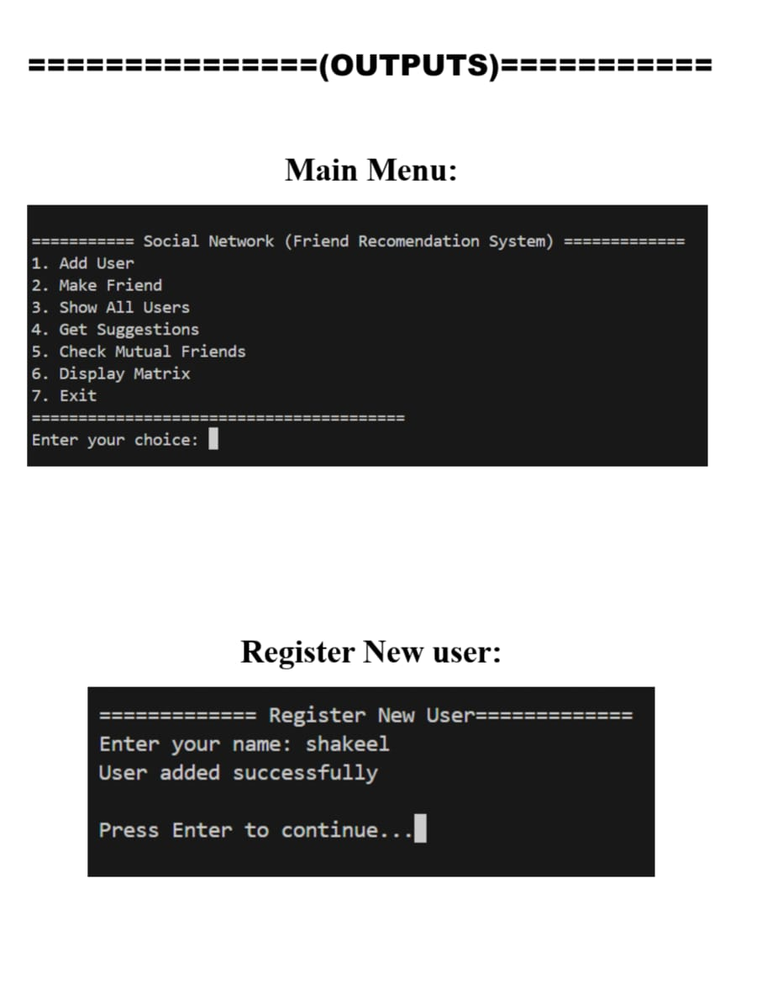
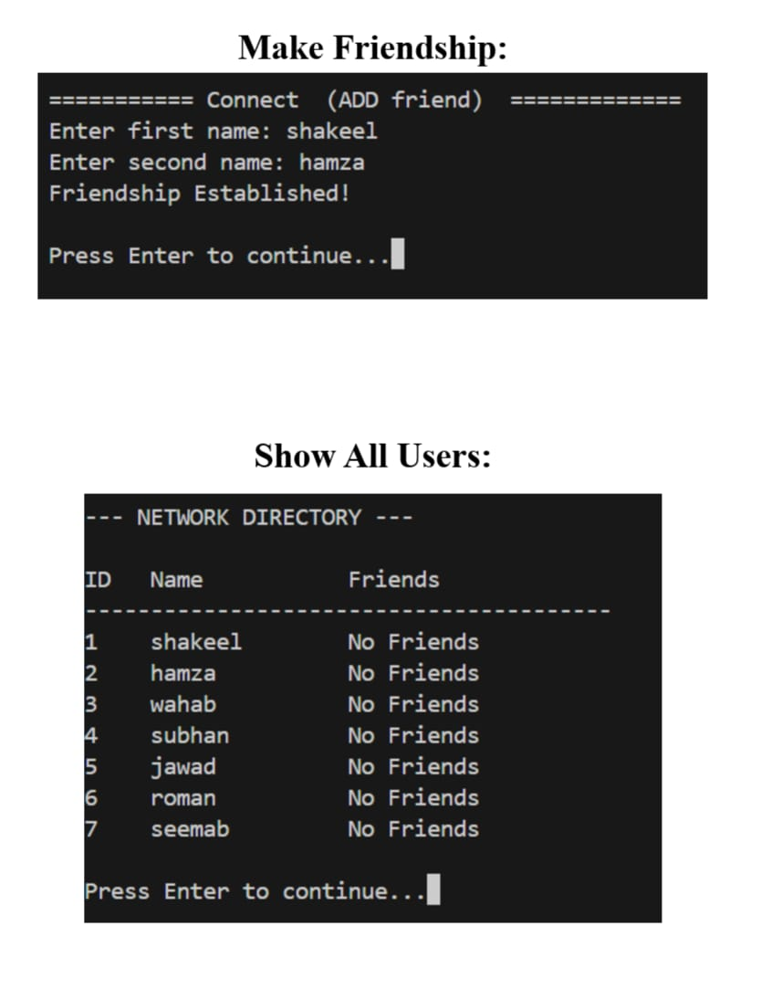
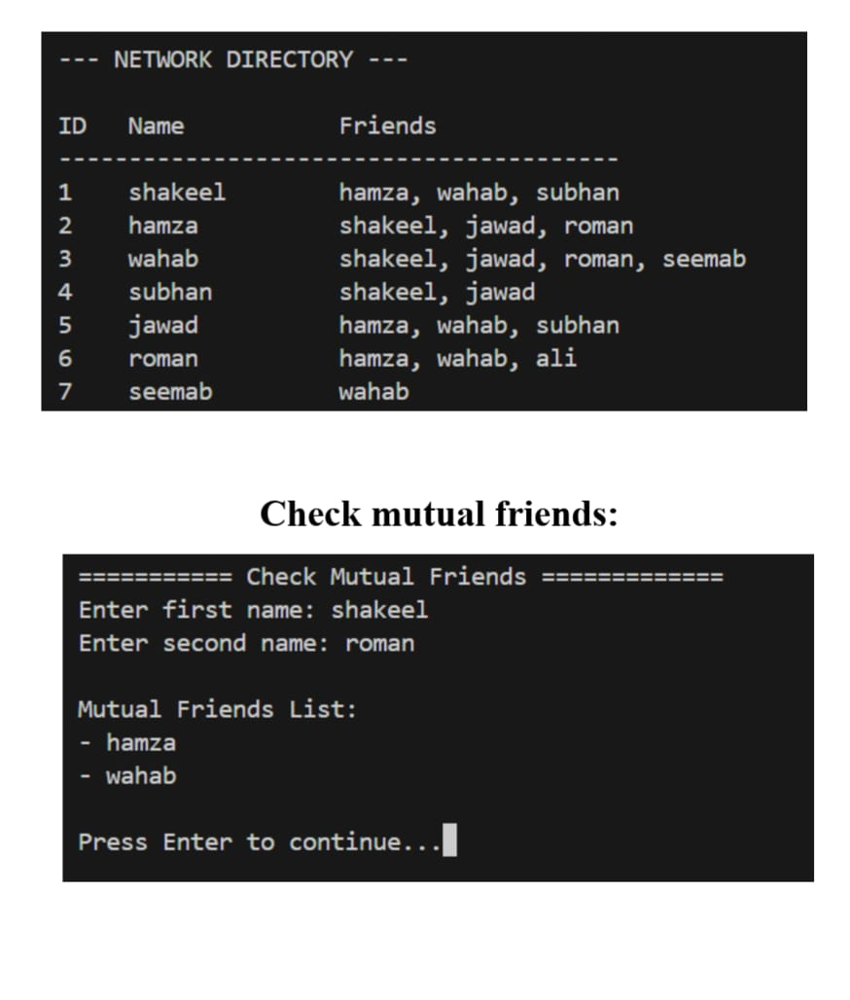
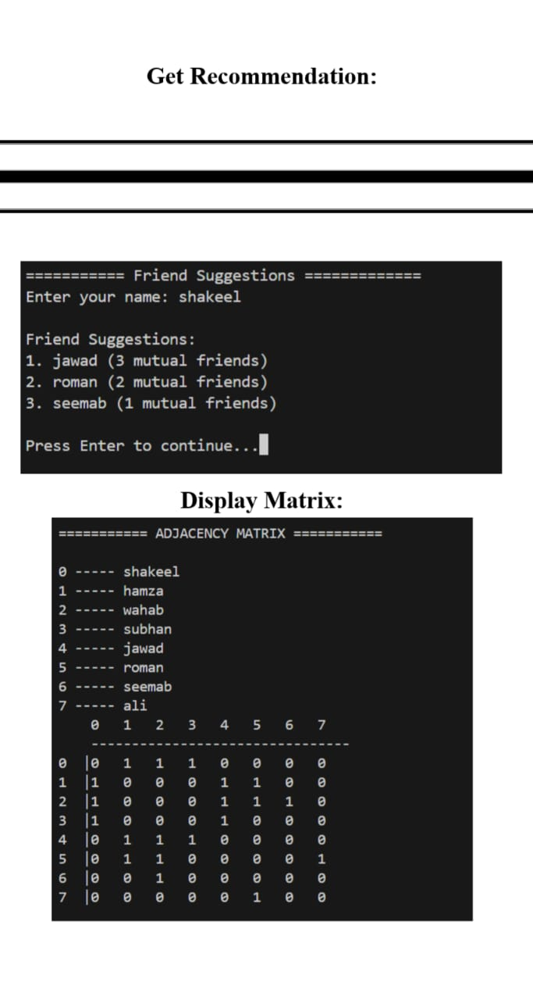

# mutual-friend-recommedation.cpp
A C++ social network simulation using an Adjacency Matrix to suggest friends based on mutual connections.

## Overview

This project is a **console-based Social Network Simulation** developed in **C++**. It demonstrates how social networks can be modeled using **Graph Data Structures**, specifically an **Adjacency Matrix**.

The system allows users to register, connect with friends, view mutual friends, and receive friend recommendations based on shared connections.

This project is designed for **Data Structures and Algorithms (DSA)** learning, showing practical implementation of graphs in a real-world inspired scenario.

 ## Features

1. User Registration

* Allows new users to register in the network.
* Prevents duplicate usernames.
* Maximum capacity of **20 users**.

2. Add Friend Connection

* Creates a friendship relationship between two users.
* Friendship is **bidirectional** (undirected graph).

3. Show All Users
4. Friend Suggestions
5.Suggests new friends based on: Mutual connections
6. Users who are not already friends

### 📊 Output Gallery

<table>
  <tr>
    <td></td>
    <td></td>
  </tr>
  <tr>
    <td></td>
    <td></td>
  </tr>
</table>

## Constraints
Maximum Network Siz0
Maximum Users = 20

This limit can easily be increased by modifying:
const int Max = 20
Concepts Demonstrated

## This project demonstrates several **Data Structures concepts**:

* Graph Representation
* Adjacency Matrix
* Searching in Arrays
* Mutual Connections Logic
* Friend Recommendation Logic
* Basic Input Validation

## How to Run

1. Compile the Program

Using g++:

g++ main.cpp -o social_network

2. Run the Program

./social_network

Example Use Case

1. Register users
2. Connect users as friends
3. View the network directory
4. Get friend recommendations
5. Check mutual friends between users

Future Improvements

Possible enhancements for the system:

* Increase network size dynamically
* Implement **Graph using Adjacency List**
* Add **Friend Removal**
* Add **User Deletion**
* GUI version of the system
* Save data using files

